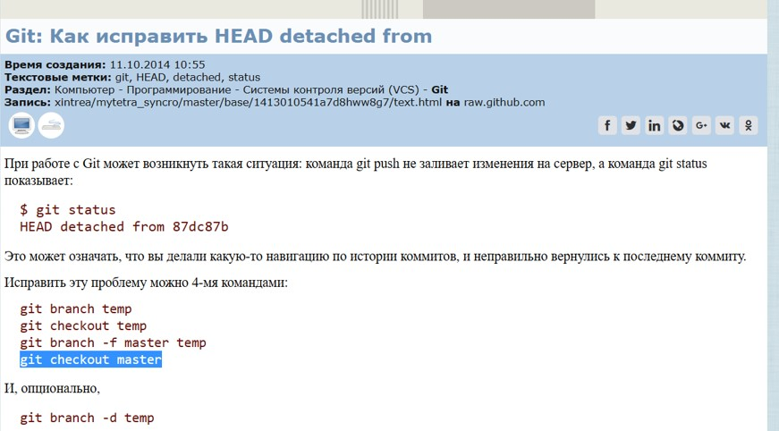

# Руководство по Git
## Локальный репозиторий
### Команды:

#### *1. Знакомство с **GIT**:*
1. *config --global user.name "**Name**"* - имя
2. *config --global user.email "**mail**"* - почта

#### *2. Начало работы с документом:*
* *init* - создание локального репозитория
* *add* - добавление файла
* *status* - состояние репозиторов
* **clear** - чистка терминала

#### *3. Сохранение файла:*
* Ctrl + S - сохранение
* *add **file*** - добавление файла (включаем в отслеживание)
* *commit -m"**comments**"* - комментируем изменения
* *commit -amend* - редактирование последнего комментария
   >Сокращение команд ~~[*add **file***, * *commit -m"**comments**"*]~~ *
  >>*commit -am"**comments**"*

#### *4. Отслеживание изменений:*
* *log* - информация об изменениях
* *checkout **4 символа комментария*** - вернуться к сохранению
* *checkout master* - вернуться к рабочей версии
* *diff* - разница между сохраненной и текущей
___
Полезная информация на сайте [***Git Hub***](https://docs.github.com/ru/get-started/writing-on-github/getting-started-with-writing-and-formatting-on-github/basic-writing-and-formatting-syntax)
___

#### *5. Отслеживание веток:*
* *branch* - информация о ветках
* *branch **name branch*** - создать ветку
* *branch -d **name branch*** - удалить ветку
* *checkout **name branch*** - перейти на ветку
* *merge **name branch*** - слияние ветки
* *log --graph* - полная информация об изменениях
  > Сокращение команд ~~[*branch __name branch__*, *checkout __name branch__*]~~
  >> *checkout -b __name branch__*

#### *6. Перемещение веток*
* *branch -f __name branch__ HEAD~2* - перенести ветку на 2 вверх.
* *checkout HEAD~2* - переместиться на 2 ветки вверх.
* *cherry-pick __name name2__* - добавление веток в активную

___
Приложение для достижения мощных возможностей ветвления и работы с git
[__*LearnGitBranching*__](https://learngitbranching.js.org/?locale=ru_RU)
___

#### *7. Работа с удаленным репозиторием*
1. Переходим по ссылке __*https://github.com/*__
2. Находим нужный репозиторий.
3. Жмем на кнопку **Fork** - *(в списке наших репозиториев появился fork)*
4. Клонируем ссылку к себе в VS
5. Открываем папку в VS 
6. Выполняем *git branch* 
7. Выполняем *git checkout*
8. Добавляем свой файл с названием
9. Выполняем *add* and *commit*
10. Выполняем *git push* - *(если git ругается, выполняем команду из подсказки)*
11. На github выполняем **pull request**

#### *7.1 Работа с удаленным репозиторием (ссылка)*
1. Создать папку
2. Копировать ссылку с __GIT HUB__
3. Вводим команду *clone __ссылка__* - копировать репозиторий
4. Вводим команду *cd __name file__* - поменять репозиторий

#### *7.2 Работа с удаленным репозиторием (команды)*
* *pull* - подгрузить с удаленного репозитория
* *push* - отправить в удаленный репозиторий
* *git push -u origin new_branch* - отправка новой ветки в удалённый репозиторий
* *pull request* — запрос на вливание изменений из вашей ветки в основную ветку исходного репозитория
* *log --all --oneline* - информация об изменениях во всех ветках
* *git shortlog* - группировка комитов по автору
* *git show* - просмотр информации о метке или коммите
* *git blame* - поиск автора последнего зменения коммита.
* *git mv [existing-path] [new-path]* - переименованиe файла;
* *git log --stat* - отображает под записью о каждой версии список измененных файлов, их количество, а также количество добавленных в них и удаленных из них строк и в конце выводит сводную информацию;

#### *8. Как исправить HEAD detached* :boom:
1. *branch temp* 
2. *checkout temp* 
3. *branch -f master temp* 
4. *checkout master* 
___
___

___
___

#### *9. Подсветка кода и выделение элементов*

С помощью апострофов `текст` будет `обрамлён`
```javascript
var s = "JavaScript syntax highlighting";
alert(s);
``````

##### __Список задач:__
- [ ] Невыполненная задача
- [X] Выполненная задача

##### __Добавление картинок:__
1. Сайт:


2. Файл:


____
##### __Добавление таблиц:__

#### Таблица

| Rank | THING-TO-RANK |
|-----:|---------------|
|     1|               |
|     2|               |
|     3|               |

___

#**Git** <sub>*полезные ссылки и материалы**</sub>

* [Настройка репозитория](https://www.atlassian.com/ru/git/tutorials/setting-up-a-repository)
* [Сохранение изменений](https://www.atlassian.com/ru/git/tutorials/saving-changes)
* [Проверка репозитория](https://www.atlassian.com/ru/git/tutorials/inspecting-a-repository)
* [Отмена изменений](https://www.atlassian.com/ru/git/tutorials/undoing-changes)
___
## [**Using Git with Visual Studio Code**](https://www.youtube.com/watch?app=desktop&v=i_23KUAEtUM)
